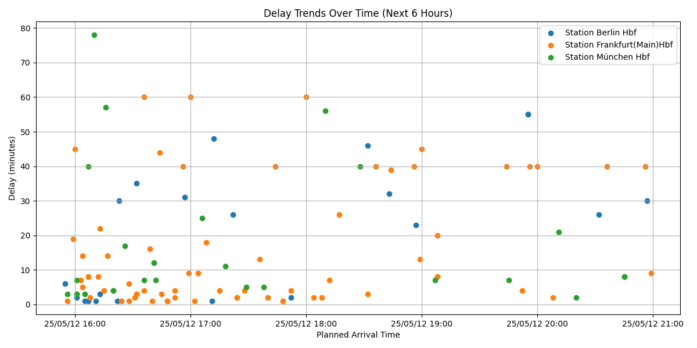

# traffic-data-analysis
## Introduction
This project analyzes live train traffic using Deutsche Bahn's [Timetables API](https://developers.deutschebahn.com/db-api-marketplace/apis/product/timetables). It retrieves all planned and real-time trips that **arrive or depart** from selected stations and visualizes delays and patterns.
## Demo
Check it out on: http://youroctopus.com/  
Here’s what the traffic information page looks like:

## Setup 
There need to be a file named .env in rootfolder to set up enviroment variables. 
### Database Connection
To connect to the postgreSQL database, .env need to contain: \
"  
DATABASE_URL = "postgresql+psycopg2://DB_USER:DB_PASSWORD@DB_HOST/DB_NAME"  \
DB_HOST=YOURHOST \
DB_NAME=YOURNAME \
DB_USER=YOURUSER \
DB_PASSWORD=YOURPASSWORD
"
### Deutsche Bahn API
To access the API, .env need to contain  
"
CLIENT_ID = "Your API ID"  
CLIENT_SECRET = "Your API Secret"
"
### Install Docker Engine (Optional)
https://docs.docker.com/engine/install/ubuntu/
## How to start
### With python
Create virtual environment for Linux and WSL(pip & virtualenv): \
run: `pip install -U pip` \
run: `sudo apt install python3 python3-pip` \
run: `pip install virtualenv` \
run: `virtualenv venv`  # erstellt im aktuellen Ordner einen Ordner 'venv' mit der virtuellen Umgebung\
run: `source venv/bin/activate`   # danach erscheint ein (venv) vor dem Command Prompt\
run: `pip install -r requirements.txt` \
run: `flask --app src/app run --debug` from root to start web application.
go to: `http://localhost:5000/`
### With Docker
run: `docker compose up -d --build` \
go to: `http://localhost:5000/`
## Tools
Database: PostgreSQL, SQLAlchemy.  
Frontend: HTML/CSS, Javascript.  
Backend: Python, Flask.
ETL & Analysis: Pandas, Matplotlib
## Data
Deutsche Bahn's Timetables-API, Interne Bahnhofsnummer(IBNR).
