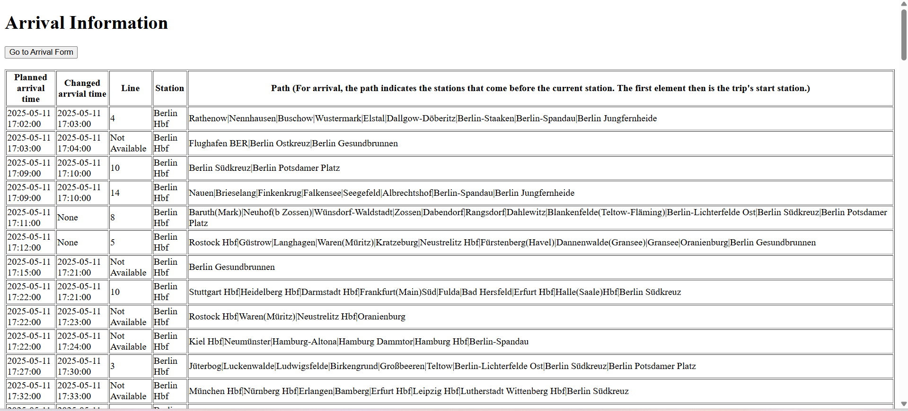

# traffic-data-analysis
## Introduction
This project uses Deutsche Bahn's Timetables-API (https://developers.deutschebahn.com/db-api-marketplace/apis/product/timetables) to analyse traffic. This includes: ETL-Prozess, data visualization and analytics using Machine Learning Algorithms.
## Demo
Here’s what the traffic information page looks like:

## How to start
Create virtual environment for Linux and WSL(pip & virtualenv): \
run: `pip install -U pip` \
run: `sudo apt install python3 python3-pip` \
run: `pip install virtualenv` \
run: `virtualenv venv`  # erstellt im aktuellen Ordner einen Ordner 'venv' mit der virtuellen Umgebung\
run: `source venv/bin/activate`   # danach erscheint ein (venv) vor dem Command Prompt\
run: `pip install -r requirements.txt` \
run: `python src/webapplication/app.py` from root to start web application
## Tools
Database: PostgreSQL 
Frontend: Html/css, Javascript, Flask
Backend: Python
## Data
Deutsche Bahn's Timetables-API, Interne Bahnhofsnummer(IBNR)